# PARTE B DEL EXAMEN: COMPLETAR EL EJERCICIO GUIADO HELLO WORLD
###### Ricardo Ramírez Berrocal
En esta tarea seguimos las instrucciones que se pueden leer en la guía [Hello World](https://docs.github.com/en/get-started/quickstart/hello-world). En esta guía se muestra:
* Cómo crear un repositorio.
* Cómo crear una rama.
* Cómo añadir y confirmar cambios.
* Cómo abrir una solicitud de mezcla de ramas.
* Cómo mezclar dos ramas.

Este repositorio, con el nombre *hello-world-examen*, es el producto de seguir la guía. Todos los pasos realizados se documentan en este **README.md**.

---
## Parte 1: Cómo crear un repositorio.
Los repositorios son la forma en la que GitHub organiza un proyecto en concreto. Los repositorios pueden contener todo lo que tu proyecto necesita, desde archivos y ficheros hasta imágenes o vídeos. Normalmente, se crea un archivo **README.md**, como este mismo, para explicar el proyecto. GitHub ofrece también otras opciones a añadir de forma automática, pero no les daremos uso en esta ocasión.

La creación de *hello-world-examen* se ha realizado siguiendo los siguientes pasos:

1. En la parte superior derecha de cualquier página de GitHub, hacemos click en el símbolo +. Se abrirá un menú, en el que existen varias opciones. Para crear el repositorio, hacemos click en `New repository`.

   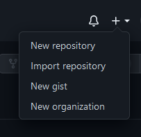
   
2. Al hacer click en `New reository`, se nos llevará a la página de creación del repositorio. Añadimos un **nombre** y una breve **descripción** y seleccionamos `Add a README file`. Para terminar de crearlo, hacemos click en `Create repository`.

   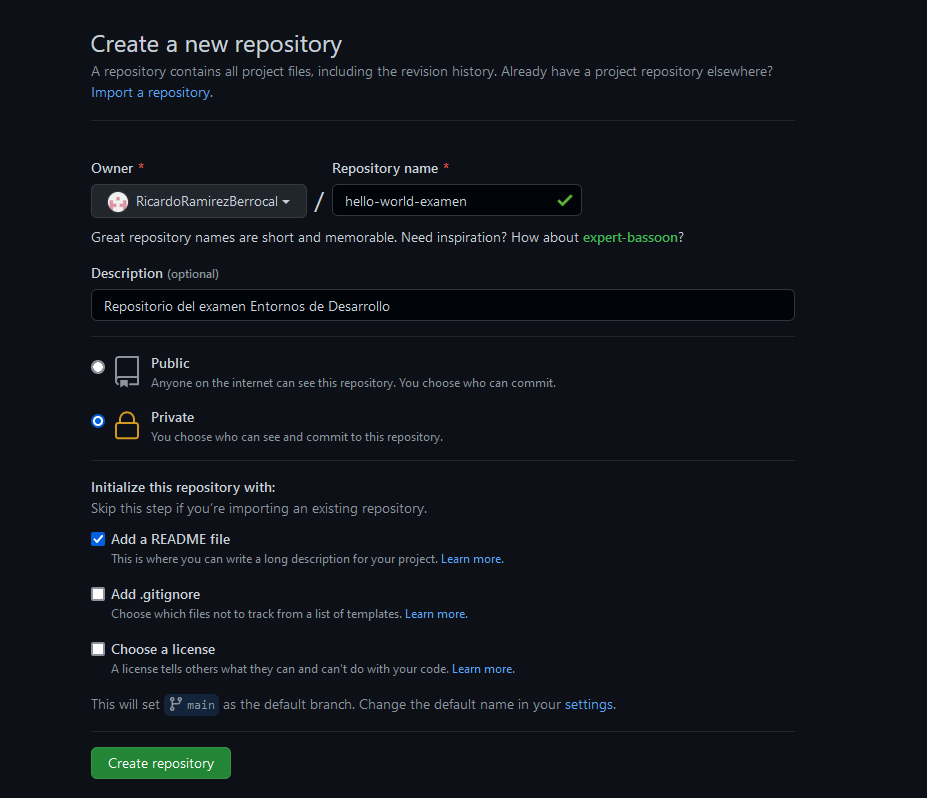

Con todo esto terminado, ya tenemos nuestro repositorio llamado *hello-world-examen* con su documento **README.md**. Ahora procederemos a trabajar con él.

---
## Parte 2: Cómo crear una rama
Si el repositorio es la organización del proyecto, las ramoas son versiones distintas del mismo proyecto. Es en estas versiones donde añadimos los cambios, ya que cualquier cosa modificada en la versión principal puede suponer la pérdida de datos que no deberían haber sido modificados.

En *hello-world-examen*, he creado dos ramas para hacer distintas funciones: la primera, `readme-edits`, se centra exclusivamente en la modificación del archivo **README.md**; mientras que la segunda, `images-upload`, añade las imágenes necesarias para que **README.md** tenga coherencia. Como las ramas se crean y trabajan de forma idéntica, explicaremos la creación y manipulación de la rama `readme-edits`.

Para crear una rama, debemos seguir estos pasos:

1. Estando en la página del repositorio. hacemos click en `main`. Nos abrirá un submenú con los nombres de las ramas en el repositorio (ahora mismo solo existe la rama `main`creada automáticamente al crear el repositorio).
2. En la barra de búsqueda de ese submenú, escribimos `readme-edits`. Como esa rama no existe, nos aparecerá la opción `Create branch: readme-edits from 'main'`. Le debemos hacer click a esa opción.

   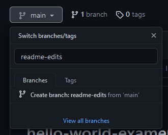
   
Con esto ya hemos creado la rama `readme-edits`. Lo podemos confirmar porque al hacer click en el mismo lugar que en el paso 1 nos aparecerá ahora tanto la rama `main` como la que acabamos de crear. A partir de ahora trabajaremos en nuestras ramas secundarias.

---
## Parte 3: Cómo añadir y confirmar cambios
Para modificar cualquier cosa de la rama `readme-edits`, obviamente, debemos estar en esa rama. Para eso, debemos seleccionarla en el submenú con el que hemos trabajado en la creación de ramas. Como es una copia de la rama `main`, no notaremos diferencias en un principio, pero de eso nos encargaremos ahora.

Vamos a modificar **README.md** para que muestre todos los pasos realizados a lo largo de la tarea. Para eso, seguimos los siguientes pasos:

1. Hacemos click en el símbolo del lápiz situado en la parte superior derecha de la presentación del **README.md**. También se puede hacer click en el archivo que encontramos en el menú del repositorio, ya que son el mismo archivo, y hacer click en el mismo símbolo.

   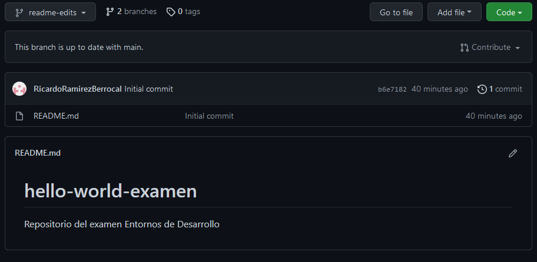

   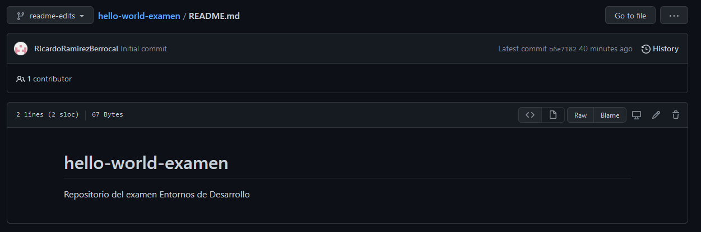
   
2. Realizamos todos los cambios que consideremos necesarios. Hay que recordar que el archivo tiene que estar escrito en formato **Markdown** Para que tenga una estética coherente y atractiva.
3. Cuando hemos terminado, los confirmaremos. Para eso, debemos poner **nombre** a la confirmación, seguido de una **descripción**. Para finalizar, hacemos click en `Commit changes`.

   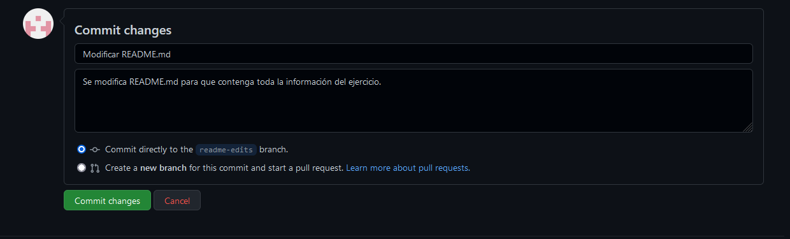

Y... ¡Listo!. El documento **README.md** de la rama `readme-edits` ha sido modificado. También se puede crear directamente en el repositorio o subir desde tu equipo local lo que tú quieras. Tan solo tienes que hacer click en `Add file` en la parte superior derecha ed tu repositorio y elegir la opción que consideres necesaria. Confirmamos los cambios como hemos hecho anteriormente con **README.md** y ya habremos terminado.

   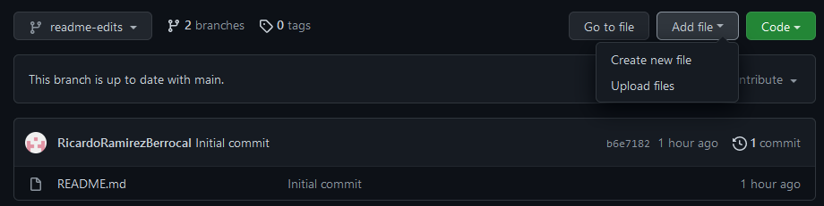

---
### Parte 4: Cómo abrir una solicitud de mezcla de ramas
Esta parte cumple un rol muy importante en los repositorios donde más de una persona colaboran en el mismo proyecto, ya que ofrece la posibilidad de mostrar los cambios que has realizado a tus compañeros. Al hacerlo, se abren las puertas a la posibilidad de mejorar los cambios que has realizado o a debatir si es buena idea incluirlos o no.

Para abrir una solicitud, debemos realizar los pasos explicados a continuación:
1. En nuestro repositorio, en la parte superior, hay varias opciones, entre las que encontramos `Pull requests`. Entramos en esa opción y hacemos click en `New pull request`.

   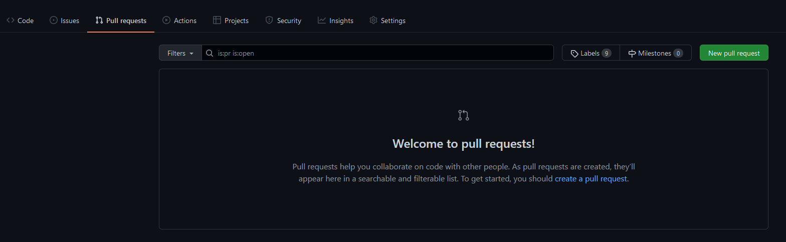

2. Seleccionamos las ramas que queremos comparar. Cuando lo hacemos, se verán los cambios que has realizado entre las dos ramas. Una vez estemos satisfechos con las opciones que hemos seleccionado, hacemos click a `Create pull request`.

   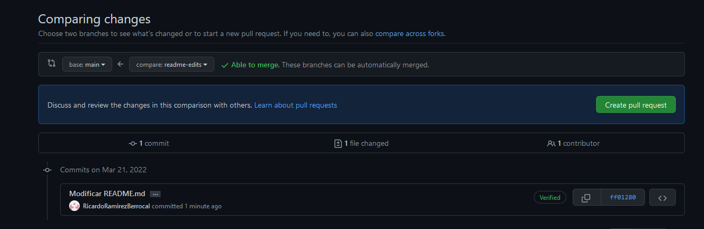

3. Añadimos un **nombre** para la solicitud, una **descripción** y acabamos haciendo click en `Create pull request`.

   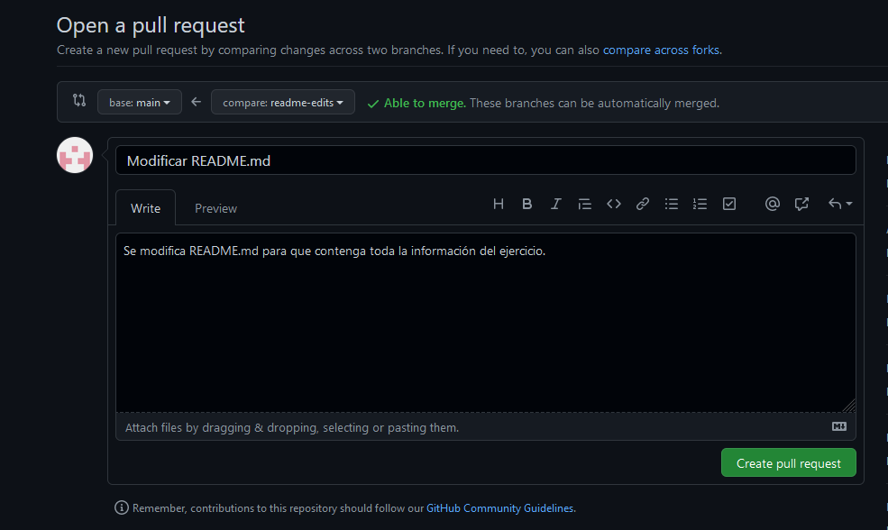

Con todo esto, ya hemos abierto la solicitud. Los colaboradores del proyecto pueden revisar los cambios y hacer sugerencias.

---
### Parte 5: Cómo mezclar ramas
Supongamos que hemos solicitado una mezcla de ramas y que nuestros compañeros han dado el visto bueno. Ahora podríamos mezclar las ramas para que los cambios realizados en la rama origen se apliquen de forma definitiva a la rama destino.

Para mezlcar ramas, solo debemos entrar en la solicitud de las ramas que queremos mezclar, hacer click en `Merge pull request` y después en `Confirm merge`. Estas dos opciones se encuentran después de todos los cambios confirmados relacionados con la solicitud.

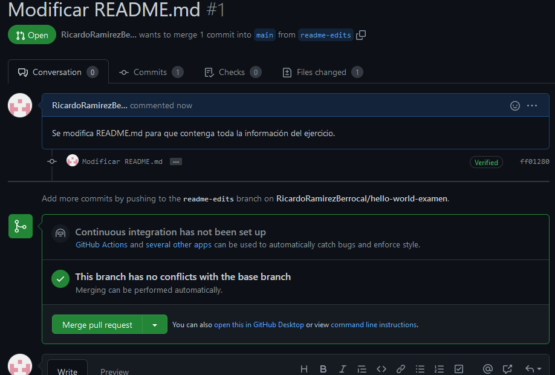
	 
Con este último paso, ya hemos incorporado nuestros cambios en la rama principal.

---
Hemos acabado con el ejercicio guiado, obteniendo como resultado este repositorio, ocn un archivo **README.md** modificado y coherente. Siguiendo la metodología explicada con anterioridad, se pueden realizar todo tipo de proyectos y colaborar simultáneamente con gente localizada en cualquier parte del mundo.
